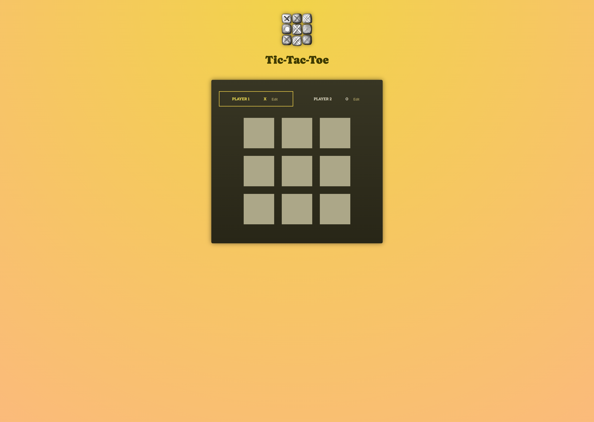

# Tic Tac Toe - React App

This project is a simple **Tic Tac Toe** game built using **React**. It demonstrates the core concepts of React, including components, state management, event handling, and rendering dynamic content based on user interaction.

## Table of Contents

- [About the Project](#about-the-project)
- [Features](#features)
- [Technologies Used](#technologies-used)
- [How to Play](#how-to-play)
- [Contributing](#contributing)
- [License](#license)
- [Live Demo](#live-demo)

## About the Project

The Tic Tac Toe game is a classic 3x3 grid game where two players take turns marking a square with "X" or "O". The goal is to get three of your marks in a row, column, or diagonal.

This project was created to practice React concepts and build a functional application. It is a great example of how React components work together to create an interactive user interface, and how state can be managed to track the game’s progress and declare a winner.

## Features

- **Dynamic Game Board**: The board is dynamically generated using React components.
- **State Management**: Tracks the current state of the game (whose turn it is, the board state, and the winner).
- **Winner Detection**: Automatically detects when a player wins or the game results in a tie.
- **Game Reset**: After a game ends, players can reset the game and start a new one.

## Technologies Used

- **React**: Used to build the entire user interface and handle the state.
- **CSS**: For styling the game board and ensuring a clean, simple design.
- **JavaScript**: Core language used for logic and functionality.
- **ES6+ Features**: Utilized modern JavaScript features like arrow functions, destructuring, and template literals.

## How to Play

1. The game starts with an empty 3x3 grid.
2. The first player marks an "X" in any empty square, and the second player marks an "O" in another empty square.
3. Players alternate turns, attempting to get three marks in a row, either horizontally, vertically, or diagonally.
4. The game automatically detects if there is a winner or if the game is a draw.
5. Once the game is over, you can click the "Restart Game" button to play again.

## Contributing

Feel free to fork this project and contribute to it! If you have any ideas for new features, improvements, or bug fixes, please create a pull request or open an issue.

## License

This project is open source and available under the MIT License.

## Live Demo

You can try out the game in action by visiting the live demo at:

[Live Demo](https://x-o-gmae.netlify.app)
